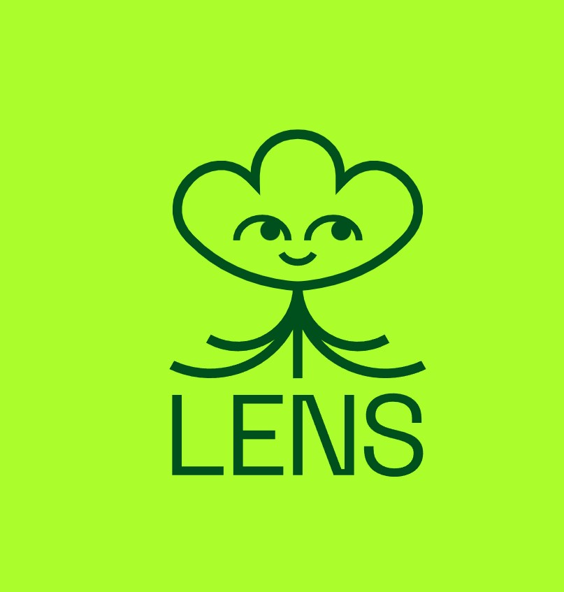

## Problem
Artists should have ownership of their music and be able to freely trade their ownership of their music.

Listeners should be able to listen to high-quality music and be able to directly support their favorite artists.

Today Web2 Apps own all user data

Users don't have control on their data

Login can be easily login with bots and fake profile

## Solution
Artists can upload their music as an NFT which gives them ownership of their music

Which then can be freely traded on any NFT marketplace

They can also attach royalties to their music so that when ownership of the song is traded between owners, they get a portion of the revenue

Music is also uploaded as lossless .wav files thanks to IPFS and Filecoin providing a safe and easy way to store large files.

This allows listeners to have access to the original audio that the artist intended for them to hear. The platform also supports tipping your favorite artists with NEAR tokens, so listeners support their favorite artists directly.

Integrated it with Unstoppable Domain so the user have control on the data , user can use scope to give access to website and enabled with Humanity Check so that BOT can't be entertained

## Why Login With Integrated Lens Integration

The Lens protocol has three layers of tokenization via ERC721 NFTs. All three are ERC721-compliant and fully composable.

Modularity is at the core of the Lens protocol. Everything is built with community expansion and the continued development of new, innovative features in mind.

The Lens Protocol is a composable social graph protocol built to be community-owned and ever-evolving. It empowers its users by allowing them to decide how they want their social graph to be built and how they want it to be monetized, if at all.

## How It's Built
There are two parts to the applications. The frontend was built using NextJS to support a faster and easier development workflow. The backend was obviously built using NEAR protocol and I did not require any 3rd party backend.

The frontend was built using NextJS to support a faster and easier development workflow. The backend was built using NEAR protocol .The login integration is done by unstopabble domains

## Link to app
https://dmusiclens.netlify.app/

## We Want To Thank Lens Protocol for Organizing DAO Global Hackathon 2023 event

